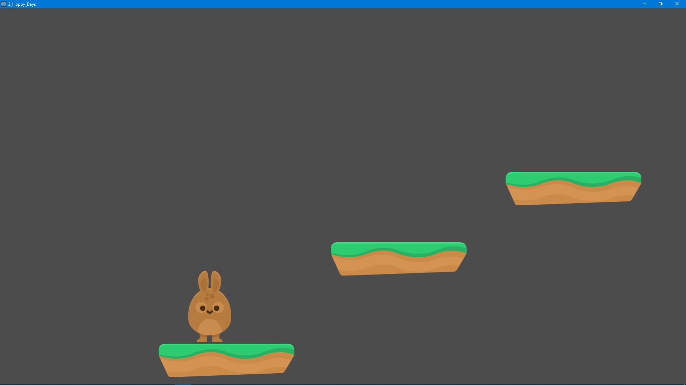
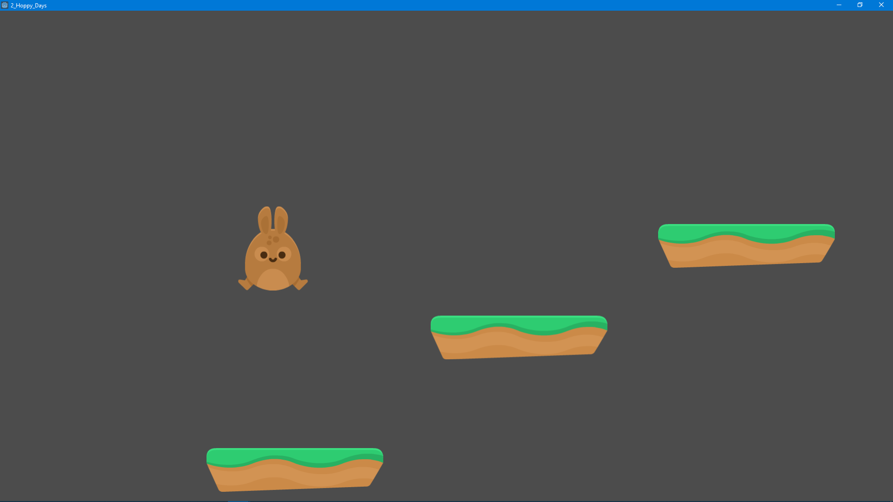
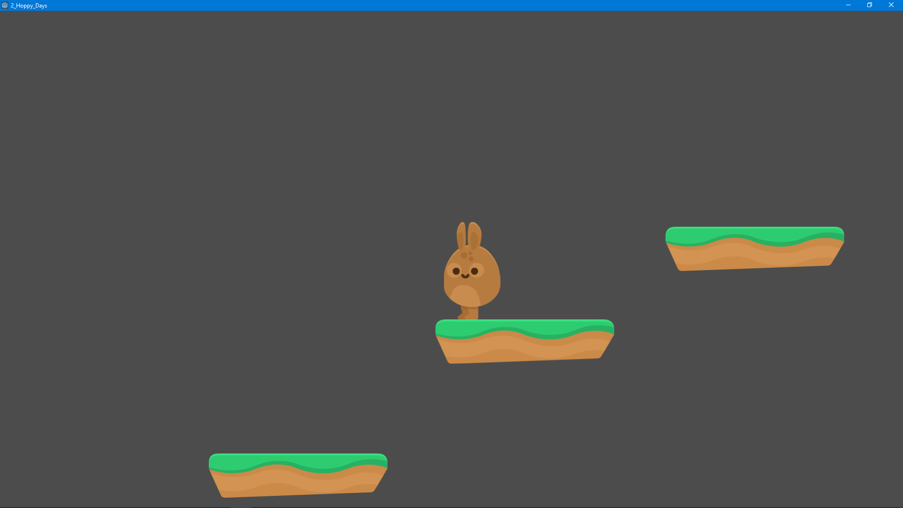
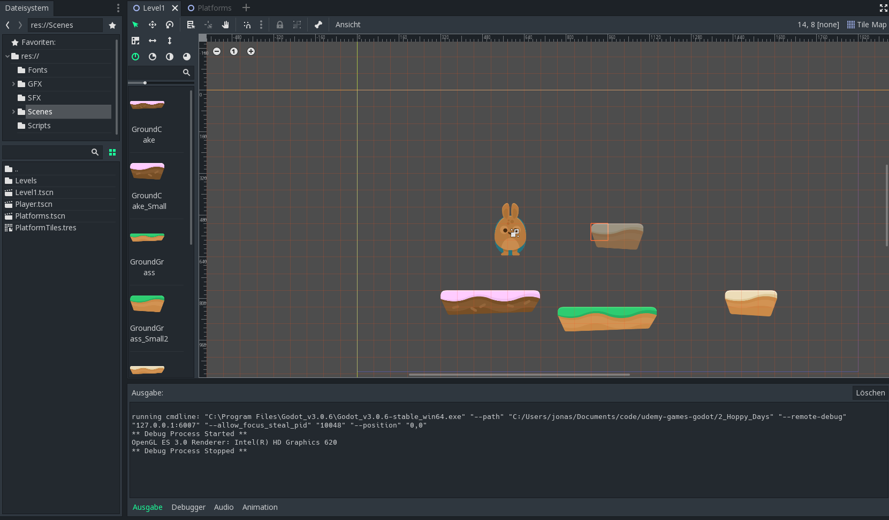
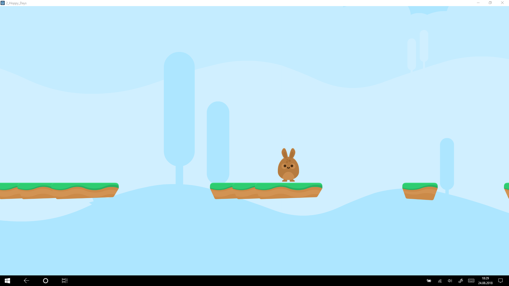
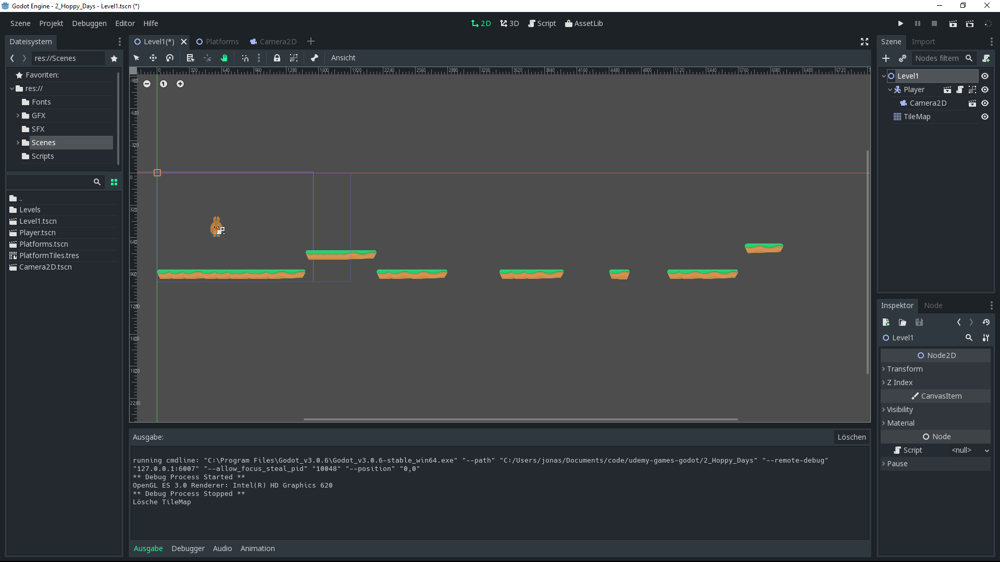
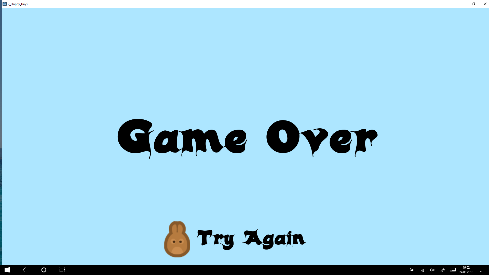
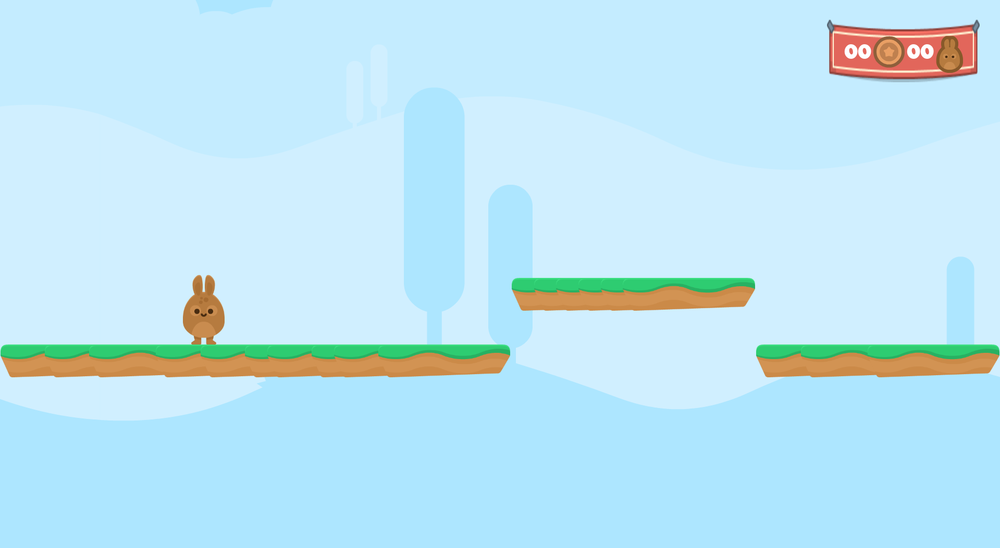

# Table of contents:
<!-- @import "[TOC]" {cmd="toc" depthFrom=1 depthTo=6 orderedList=false} -->

<!-- code_chunk_output -->

- [Table of contents:](#table-of-contents)
- [Screenshots](#screenshots)
	- [Hoppy Days](#hoppy-days)
		- [State 23.08.18 (after Lection 28)](#state-230818-after-lection-28)
		- [State 24.08.18 (after lection 33)](#state-240818-after-lection-33)
- [Overview](#overview)
- [Learning Log](#learning-log)
	- [Section 1](#section-1)
		- [103: Installing GoDot](#103-installing-godot)
		- [105: Hello GoDot.](#105-hello-godot)
	- [Section 2: Loony Lips](#section-2-loony-lips)
		- [207: Game Requirements](#207-game-requirements)
		- [208: Introducing Arrays](#208-introducing-arrays)
		- [209: RichTextLabel](#209-richtextlabel)
		- [210: LineEdit](#210-lineedit)
		- [211: Using Player´s Input](#211-using-player%C2%B4s-input)
		- [212: queue_free and reload_current_scene](#212-queuefree-and-reloadcurrentscene)
		- [213: Dictionaries for Story Templates](#213-dictionaries-for-story-templates)
		- [214: JSON and File](#214-json-and-file)
		- [215: Using Git with GoDot](#215-using-git-with-godot)
		- [216: Visual Studio Code](#216-visual-studio-code)
	- [Section 3: Hoppy Days](#section-3-hoppy-days)
		- [325: PhysicsBody 2D - Making a Character](#325-physicsbody-2d---making-a-character)
		- [326: AnimatedSprite - Making Bunny Run](#326-animatedsprite---making-bunny-run)
		- [327: Jumping](#327-jumping)
		- [328: Cleaning up - Player Code](#328-cleaning-up---player-code)
		- [329: Tilemaps- Making a level](#329-tilemaps--making-a-level)
		- [331: Parallax Backgrounds](#331-parallax-backgrounds)
		- [332: Game Over Screen](#332-game-over-screen)
		- [333: Area2D Making Spike Hazard](#333-area2d-making-spike-hazard)
		- [334: Control Nodes - Making a GUI](#334-control-nodes---making-a-gui)
		- [335: Gamestate.gd](#335-gamestategd)
		- [336: Global Scripts](#336-global-scripts)
		- [338: Updating the GUI](#338-updating-the-gui)
		- [339: AnimationPlayer - Making Coins](#339-animationplayer---making-coins)
		- [340: Polishing the GUI:](#340-polishing-the-gui)

<!-- /code_chunk_output -->

# Screenshots

## Hoppy Days
### State 23.08.18 (after Lection 28)
idle | move 
- | - 
 | 
 | 

### State 24.08.18 (after lection 33)
tilemaps | game 
- | - 
 | 
 | 

# Overview

Kurs gestartet am 19.08.2018

* [x] Section 1: 19.08.2018
    - [x] Lektion 1
    - [x] Lektion 2 
	- [x] Lektion 3  
	- [x] Lektion 4
	- [x] Lektion 5
	- [x] Lektion 6
- [ ] Section 2: 19.08.2018
	- [x] Lektion 7
	- [x] Lektion 8
	- [x] Lektion 9
	- [x] Lektion 10
	- [x] Lektion 11 
	- [x] Lektion 12
	- [x] Lektion 13
	- [x] Lektion 14 
	- [x] Lektion 15
	- [x] Lektion 16
	- [ ] Lektion 17
	- [ ] Lektion 18
	- [ ] Lektion 19
	- [ ] Lektion 20
    - [ ] Lektion 21
	- [ ] Lektion 22
* [ ] Section 3: 23.08.2018
	* [x] 23
	* [x] 24
	* [x] 25
	* [x] 26
	* [x] 27
	* [x] 28
	* [x] 29
	* [x] 30
	* [x] 31
	* [x] 32
	* [x] 33
	* [x] 34
	* [x] 35
	* [x] 36
	* [x] 37
	* [x] 38
	* [x] 39
	* [x] 40
	* [ ] 41
	* [ ] 42
	* [ ] 43
	* [ ] 44
	* [ ] 45
	* [ ] 46
	* [ ] 47
	* [ ] 48 

# Learning Log
## Section 1 
### 103: Installing GoDot 

Verfügbar für:
- Windows
- Mac
- Linux

Installation auch über Steam möglich

Versionen:
- Python Script
- C# Support with Mono.

### 105: Hello GoDot. 

GoDot related: (GDScript)

- A script with out a node won´t be run
- Press Scene "add" to add nodes: 
    - blue is 2d
    - red is 3d 
- Press Scene "add script" to add first script 

Scripts: 
- pass is like return nothing 

Python:
- is a dynamic typing language
- "#" is for comments
- no curly braces {}, instead use tab indentions

Others:
- cool theme "Alien": Editor Settings -> Theme 

## Section 2: Loony Lips 

### 207: Game Requirements 

a word game
- ask for a word based on type (nouns, verb,etc)
- stories to plug the words into
    - expandable template for stories

### 208: Introducing Arrays 

- node Convention is CamelCase
- string escaping with "%s" : for strings.
`print(story % prompt)`

### 209: RichTextLabel 

- every scene has one "root" node (only access via code)
- in the scene editor you can only see the oldest parent node
- TextureRect node is for showing images
- project settings -> Display - Window to resize player camera size

- `get_node(Blackboard/StoryText)`  = `$Blackboard/StoryText` 
- RichTextLabel´s input can be controlled via `.text` and `bbcode_text` (*bbcode_text* can be bold, italic, etc..)

### 210: LineEdit

- Node: TextEdit is good for user input with multiple lines
- Node: LineEdit : single line text editing
- Instead of creating small scripts for each subnode, we acn use **signals**
- Signals can be created inside the script or from the *node inspector* (bottom right). select *text_entered* and click *connect* 
- TextureButton
- you can lock nodes to not move children nodes without purpose.

Created two signals in script:
- `func _on_TextureButton_pressed():`
- `func _on_TextBox_text_entered(new_text):`

### 211: Using Player´s Input

- if statements in python
- `if thing > 0 : ` `elif anothercondition` `else dothis`  

### 212: queue_free and reload_current_scene

- `queue_free` removes nodes and set them free 
- `get_tree` gets complete tree instead of nodes

### 213: Dictionaries for Story Templates

- `randomize()` will create a random seed
- `randi()` will create a random number (integer)
- needs to be between 0 and array length -> 

### 214: JSON and File

- seperates object to *key* and *value*
- To read a file and convert it to json
	- `var file = File.new()`
	- `file.open(filename, File.READ)`
	- `var text = file.get_as_text()`
	- `var data = parse_json(text)`
	- `file.close()` - remember to close filestreams to prevent memory leaks.
	- `return data`
- very nice for localization.

### 215: Using Git with GoDot
### 216: Visual Studio Code

* Install Extensions
  * GoDot Tools
  * C#

* Project Settings - Editor Settings
  * Activate External Editor
  * Set your "Exec Flags" as follows...
	`{project} --goto {file}:{line}:{col}` 

## Section 3: Hoppy Days

23.08.2018 - today

* 23.08.18: around 1,5h (23-28)
* 24.08.18: around 1,5h (29-32)
* 25.08.18: (33)

### 325: PhysicsBody 2D - Making a Character

* add some node 2d (blue) 
* PhysicsBody2D (base class)
	* StaticBody2D shoudd not move
	* RigidBody2d is passively moved, but has gravity
	* KinematicBody2d without Gravity, but can be controlled direclty
* green nodes are containers
* collisionshaee is needed for kinematic body
	* dont try to scale collisionscapes
	* game run will reset it
	* click on it set radius or change accents
* collision bottom should be feet, not body to get track of the floor
* Input.is_action_pressed takes a string as key parameter
	* those values are defined in the project settings -> input map -> e.g. "ui_right"
	* you can easily add keyboard keys to those values, e.g. add 'W' and 'Space' for "ui_up"
* KinematicBody2D movement
	* move_and_collide() : 
		* stop when you hit sth
		* get collision information
		* no auto use of 'delta'
	* move_and_slide():
		* hit sth -> try to move along it
		* can detect walls, floors, etc
		* auto use delta when moving

### 326: AnimatedSprite - Making Bunny Run

* instead of Sprite use AnimatedSprite
* call animations in script via `.play(animationname)`
* make sprites flip with setting boolean to `.flip_h`

### 327: Jumping

* instance of scene is similiar to a prefab
* blue view : camera
* change main scene under project-settings -> run
* godot´s coordinate system starts at the top left with 0,0 
	* to go 1 unit up its Vector2(0, -1)

### 328: Cleaning up - Player Code

* elegant code
	* easy readable for human
	* one script should ony be responsible for one thing

### 329: Tilemaps- Making a level

* tilemap is like a paint palette
* make levels very quickly
* collision layers can keep track of what interacts which others
* collision mask : what layers we can interact with
	* can be defined in project settings -> Layer Names (2d Physics
	* 
* scenes can be converted to texture resources
	* scene -> transform to -> tileset
	* need .tres or .res extension in filename
* camera2d to active 
	* set it to be a child of player
	* link it from camera scene
	* change limits for left and bottom 

### 331: Parallax Backgrounds

* parallax
	* phenomen, where objects seem to be in different positions based on your viewing angle
	* the closer a layer is ,the faster it will move
		* background is very slow
		* foreground is very fast
	* faster the layer moves, the faster the player will feel like they´re going
	* speed of parallax will be controlled through `Scale` in Godot

### 332: Game Over Screen

* node color green is for ui
	* blue for 2d
	* red for 3d
* ui elements have a layout option inside the main nav (above the scene)
	* you can select full rect to expand to the whole view
	* you can select full rect to expand to the parent node (if child selected)
* right click on scene to copy path 
	* suitable for `change_scene()`

### 333: Area2D Making Spike Hazard

* area2d
	* detection and 2d influence
	* just do sth whenever we have a collision

### 334: Control Nodes - Making a GUI

* anchors tell godot where to calculate margins from
* you can make anchors visible
* several control nodes can sort things automatically

### 335: Gamestate.gd
### 336: Global Scripts

* more convenient
	* linking is easier between nodes
* more robust 
	* no string references in node paths

* scripts can be added to autoload
	* project settings -> autoload -> add scripts
	* can be marked as singleton

### 338: Updating the GUI

* str(integer var) is casting an int to a string

### 339: AnimationPlayer - Making Coins

* you can define key frames with various types from nodes (select key symbol)
* animationPlayer can also call functions inside the animation

### 340: Polishing the GUI:

* onready var gets executed before the other functions
* used to get nodes as variables